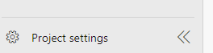
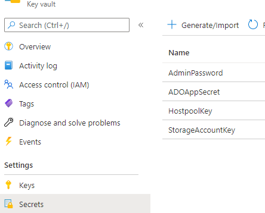
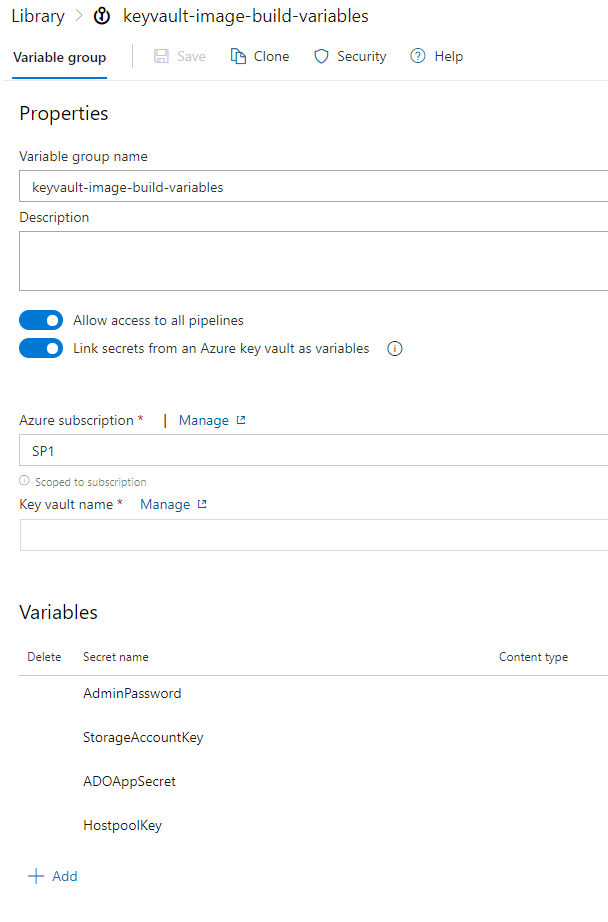

# Windows Virtual Desktop (WVD) - Host Pool Image Automation

# Introduction
There's multiple ways to manage images for Windows Virtual Desktop, this is a way that I've been exploring leveraging Azure DevOps, Packer, Shared Image Gallery and automation.

# Pre-requisites
- An Azure Subscription
- Virtual Network for Session Hosts with line of sight to your Active Directory domain environment
  - An existing Subnet for the Session Hosts
- Resource Group for WVD Resources
  - Host Pool
  - Workspace
  - Session Host(s)
  - Azure File Share Storage Account joined to domain FSLogix Profiles
- Resource Group for Image Management
  - Shared Image Gallery
  - Image Definitions
  - Image Versions
- Azure DevOps (ADO) Microsoft Hosted Agents for Pipelines
- Azure AD Connect syncing your domain 
- An existing Windows Virtual Desktop Pooled Host Pool registered to a Workspace with Desktop Application Group **(No existing hosts)**
  - If non-existent, create a pooled Host Pool through the Azure Portal, register the desktop app and create a WVD workspace to register it to

# Process

## Storage Account

It is a good idea for user profiles to be stored in a central location when not using assigned desktops. This allows seamless attachment of user profiles with FSLogix technology to the session host users are placed on. 

A prescriptive guide on how to domain join your storage account can be found here:

[Enable AD DS authentication for your Azure file shares](https://docs.microsoft.com/en-us/azure/storage/files/storage-files-identity-ad-ds-enable)

Instead of direct assignment of SMB Permissions to users, look to assign a group which contains your users that will utilize the WVD service to the permissions.

Further information on FSLogix for the Enterprise can be found here:

[FSLogix for the Enterprise](https://docs.microsoft.com/en-us/azure/architecture/example-scenario/wvd/windows-virtual-desktop-fslogix)

And more information on policy scale with FSLogix for the enterprise can be used here:

[Use FSLogix Group Policy Template Files](https://docs.microsoft.com/en-us/fslogix/use-group-policy-templates-ht)

## Shared Image Gallery

Inside of the resource group for image management, a Shared Image Gallery should be created. 

An image definition should be created and the value taken down. The below screenshot shows my example:

## Storage Account Creation

Applications that you wish to install on your image should be stored in an Azure File Share. This share will be mounted onto the virtual machine that Packer builds to install applications which is part of the provisioner scripts.

For the purpose of this exercise the storage account in question is General Purpose V2, LRS redundancy, Hot performance tier which contains one Azure File Share called 'installers'.

Inside of the storage account are the folders you create for each of your apps. The screenshot shows the share, folder for VSCode and the VSCode installer:

## Key Vault Creation

An Azure Key Vault is created to store secret variables to be used in the Azure Pipelines. This is a standard SKU Key Vault which has an access policy for the Service Connection created below to access the secret. The rights required are 'Get' and 'List'. 

## Service Connection between ADO and Azure

Upon creation of the ADO project, create a service connection to the deployment subscription by going to 'Project Settings':

There will be 'Service connections':

Create the first service connection:

'Azure Resource Manager' should be selected:

Have ADO automate the creation of the service principal:

The target will be subscription level. The subscription should be selected, nothing else:

It's worth validating the Service Principal has the 'Contributor' RBAC role on the subscription in context for the project.

## Variable Creation

There are two types of variables which will be used. General variables and secret variables. These will exist inside of variable groups in ADO.

A Key Vault should be created in the subscription which will be used to hold the secret variables which are defined [here](secretvarsdefinition.md):

When creating the Variable Group for the secrets, the name in the screenshot below should be used. The variables will look like the following:

And the general variable group will look like this. General variables are defined [here](nonsecretvariables.md):

The above shows empty variable values, but when working with this guide they should be filled in accordingly. 

## Importing the GitHub Repo

Working with the files will be done by importing the repo into Azure Repos in ADO.

Underneath 'Repos' is 'Files' which will take you to the options for repository creation. 

The import task will be used:

Which will be filled in accordingly. *(This repository does NOT require authentication)*:

Once the import is complete, the repo will be populated with the files needed.

## Pipeline Creation

There are two Pipelines which are created from the YAML files. They are as follows:

| File Name | Description |
|---|---|
| azure-pipelines.yml | This is the Packer pipeline used for image building |
| DeployMS.yml | This is the session host deployment Pipeline |

The Packer Pipeline is the first pipeline to run. This is done through an importing process:

The first pipeline is created:

Select where the code is located. In this exercise this is in the Azure Repos that has been imported as YAML files:

Select the repository that has been imported:

Select Existing Azure Pipelines YAML File:

There will be two options, the first pipeline to be created is *azure-pipelines.yaml*.

Drop down the 'Run' and select 'Save'.

Renaming the pipeline allows for ease of management:

Labelling the Packer pipeline 'Packer' helps to differentiate between the image build and the host deployment:

Selecting New Pipeline allows for the process to be repeated for the *DeployMS.yml* file:

Edit the pipeline, select the three dots to go into the Triggers:

The triggers need to be changed to the following:

The Packer pipeline should be run first, this will create the first image version under the pre-created defintion in the shared image gallery. Once done, the Session Host pipeline should then trigger off the completion of the packer pipeline. This will deploy the session hosts to the host pool.

